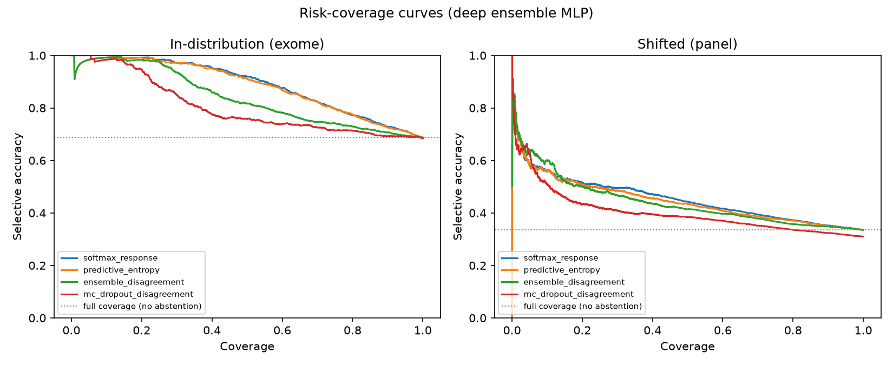
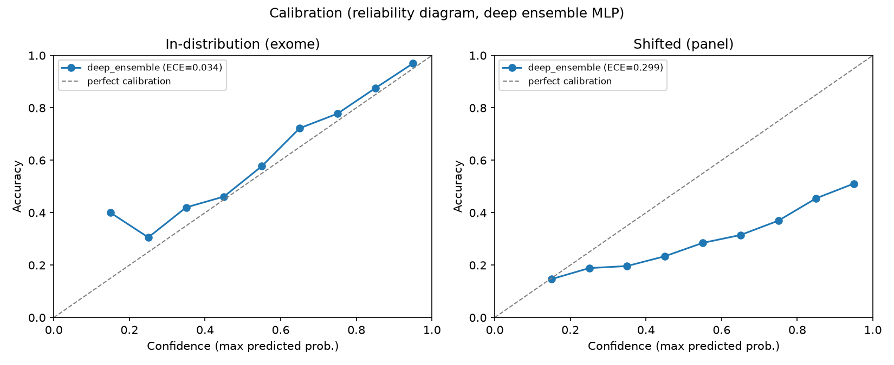
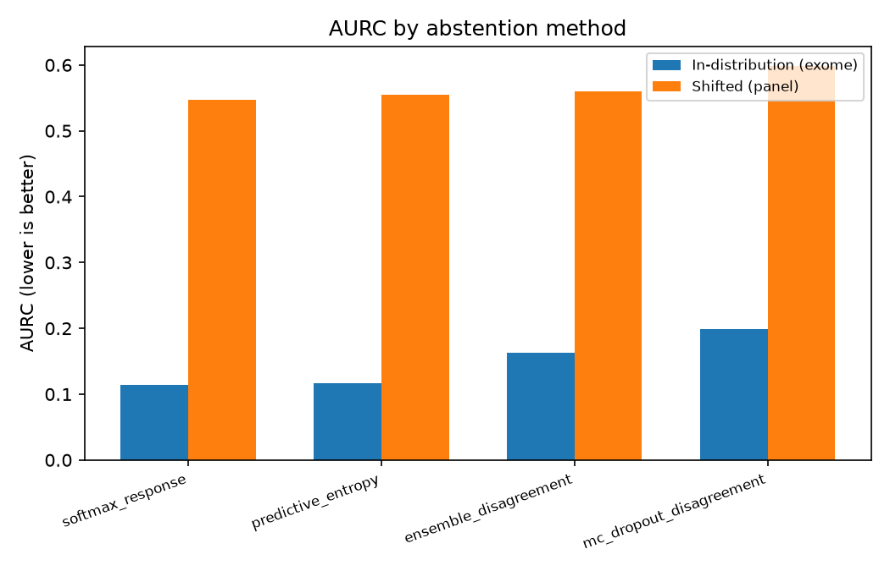

# SHIFT-ABSTAIN

**Tumor-origin classification that knows when to defer.**

A tumor-type classifier trained on whole-exome somatic mutation data and
evaluated under a real, unforced distribution shift — the same shift a
model faces going from research-grade sequencing to the targeted gene
panels actually used in the clinic. Paired with a calibrated abstention
policy so the model reports "I don't know" instead of a confident wrong
answer when the shift breaks it.

This is a research-style portfolio project, built end to end: public data
acquisition, feature engineering, baseline modeling, uncertainty
quantification, full selective-prediction evaluation, and a served demo —
with every number in this document produced by the code in this repo and
cross-checked against its own output before being written down here.

> **The honest headline result:** accuracy drops from **68.7% → 33.5%**
> under the shift (a 35-point loss), and calibrated abstention recovers
> only a **modest fraction** of that loss — not most of it. That negative
> result, and the calibration failure behind it, is the actual finding of
> this project. See [Results](#results).

---

## Table of contents

- [Motivation](#motivation)
- [The shift, precisely](#the-shift-precisely)
- [Method](#method)
- [Results](#results)
- [Limitations](#limitations)
- [Repository layout](#repository-layout)
- [Running it](#running-it)
- [References](#references)

## Motivation

Selective prediction — a model that abstains rather than answers when it
isn't confident enough to be trusted — matters most exactly where
distribution shift is unavoidable: a model trained on one hospital's,
one platform's, or one sequencing assay's data will always eventually see
data that doesn't look like its training set. In cancer genomics this is
routine, not exceptional: research cohorts (TCGA) are whole-exome or
whole-genome; clinical deployment (MSK-IMPACT, FoundationOne, and similar)
is a targeted gene panel, chosen for cost and turnaround time, not because
it's statistically equivalent to an exome.

The question this project asks is narrow and answerable: **if you train a
tumor-origin classifier on exome data and hand it panel data, how much
does it break — and does asking the model to know its own limits actually
help?** The answer here is a genuine, unglamorous "somewhat, but not
nearly enough" — which is itself useful to know before trusting a model
like this in a setting where the exome/panel mismatch is the norm rather
than the exception.

## The shift, precisely

| | In-distribution | Shifted |
|---|---|---|
| Source | [TCGA PanCancer Atlas](https://www.cbioportal.org/) | [MSK-IMPACT](https://www.mskcc.org/msk-impact) (Zehir et al. 2017) |
| Assay | Whole-exome sequencing | Targeted panel (341- or 410-gene versions) |
| Captured footprint | ~38 Mb | ~0.90–1.02 Mb (~1/40th) |
| Samples used | 8,215 | 7,803 |
| Genome build | GRCh37 | GRCh37 |

Both cohorts are pulled directly from the public
[cBioPortal datahub](https://github.com/cBioPortal/datahub) (see
`scripts/fetch_cbioportal_lfs.py` — the datahub stores files as Git LFS
objects behind a custom server; this resolves them without needing the
`git-lfs` binary). 14 cancer types are shared across both cohorts after
reconciling TCGA's 32-study taxonomy against MSK's 58 free-text cancer
types (NSCLC, Breast, Colorectal, Glioma, Prostate, Pancreatic, Renal,
Esophagogastric, Bladder, Melanoma, Thyroid, Ovarian, Endometrial, Head &
Neck) — full mapping and sample counts in
[`docs/phase0_data_spike.md`](docs/phase0_data_spike.md).

### Features

Per sample: a 96-channel COSMIC-style SBS trinucleotide mutational
context profile, tumor mutational burden (TMB), and 30 pan-cancer
driver-gene mutation flags (`TP53`, `KRAS`, `PIK3CA`, `EGFR`, `IDH1`, …
— restricted to genes present on the *smaller* MSK panel version, so a
flag means the same thing for every sample regardless of which panel
version it came from).

Every count-based feature is normalized by captured footprint
(mutations per Mb) — **this is the scientific crux of the project.**
Without it, a model can trivially separate exome from panel samples by
raw mutation count instead of learning anything about tumor biology, and
any "shift-robustness" result would be meaningless. The exome side uses
the standard 38 Mb TCGA TMB denominator; the panel side uses per-panel-
version footprints (0.901587 Mb / 1.021743 Mb) that were **not** taken
from a citation, but reverse-engineered directly from MSK's own published
per-sample TMB values (`n_nonsyn / TMB_NONSYNONYMOUS` is a near-exact
constant within each panel version — verified on >96% of samples). Full
derivation, and an explicit discussion of what this normalization does
*not* fix (TCGA and MSK-IMPACT report synonymous/intronic variants at
very different rates, an artifact of clinical-panel reporting conventions
that's folded into the measured shift and can't be fully separated from
the real capture-footprint effect): [`docs/normalization.md`](docs/normalization.md).

## Method

```
cBioPortal datahub ──▶ MAF + clinical files (Git LFS, resolved without git-lfs)
        │
        ▼
scripts/extract_features.py   SBS-96 context (hg19.2bit lookup) · TMB · driver flags
        │
        ▼
scripts/build_dataset.py      footprint normalization · 14-class taxonomy mapping
        │
        ├──▶ scripts/train_baseline.py     GBM + sklearn MLP (Phase 2)
        │
        └──▶ scripts/train_ensemble.py     5-seed deep ensemble + MC-dropout MLP (Phase 3)
                    │
                    ▼
             scripts/evaluate.py            risk-coverage · AURC · selective accuracy · ECE (Phase 4)
                    │
                    ▼
             api/inference.py + api/main.py  FastAPI + Gradio demo, same feature/normalization code (Phase 5)
```

- **Models**: gradient-boosted trees (`sklearn.HistGradientBoostingClassifier`)
  and a 2-layer MLP — deliberately small, per project scope.
- **Uncertainty**: a 5-seed **deep ensemble** (Lakshminarayanan et al.
  2017) and **MC-dropout** (Gal & Ghahramani 2016), both on the MLP.
- **Abstention scores**: softmax response, predictive entropy, and
  ensemble disagreement (mutual information / BALD), evaluated
  head-to-head rather than assumed.
- **Training protocol**: TCGA (exome) only, 70/15/15 stratified
  train/val/test. MSK-IMPACT (panel) is held out **entirely** from
  training and threshold selection — used only as the final shifted
  evaluation set, matching a realistic deployment where labeled shifted
  data usually isn't available to tune on.

Every phase's reasoning, decisions, and caveats are written up as they
happened in [`docs/phase0_data_spike.md`](docs/phase0_data_spike.md)
through [`docs/phase6_docker_readme.md`](docs/phase6_docker_readme.md) —
including the places where an initial approach was revised (e.g. the
panel footprint value) once a better one was found.

## Results

Deep-ensemble MLP, full test sets (n=1,233 exome / n=7,803 panel):

| Coverage | In-distribution accuracy | Shifted accuracy |
|---|---|---|
| 100% (no abstention) | 68.7% | 33.5% |
| 90% | 72.5% | 35.0% |
| 80% | 77.6% | 37.1% |
| 50% | 91.1% | 43.3% |
| 10% | 99.2% | 56.4% |



**Abstention helps but does not close the shift gap.** Even discarding
90% of panel samples and keeping only the most-confident 10%, shifted
accuracy (56.4%) still falls short of the *unfiltered* in-distribution
accuracy (68.7%). This is a negative result relative to the project's
original hypothesis, reported as-is rather than reframed as a success.

### Why: calibration collapses under shift

| Confidence variant | ID ECE | Shifted ECE |
|---|---|---|
| Single model | 0.033 | 0.404 |
| Deep ensemble | 0.035 | 0.299 |
| MC-dropout | 0.080 | 0.236 |



The model is close to well-calibrated in-distribution and becomes badly
**overconfident** under shift — predictions made at ~95% confidence on
panel data are right only ~51% of the time. This is the direct mechanism
behind the limited abstention recovery above: a confidence signal that
has decoupled from actual correctness can't rank samples for deferral
nearly as well as one that hasn't.

### Which abstention score actually earns its complexity



`softmax_response` and `predictive_entropy` (closely tied) beat
`ensemble_disagreement` on both splits (AURC 0.114–0.117 vs. 0.163
in-distribution; 0.547–0.554 vs. 0.560 shifted) — a specific, useful
negative result about which of the three abstention baselines actually
helps on this problem. The simplest signal wins.

Full numbers: `results/metrics_baseline.json`,
`results/metrics_uncertainty.json`, `results/metrics_evaluation.json`,
`results/accuracy_vs_coverage.csv`. Per-phase detail:
[`docs/phase2_baseline.md`](docs/phase2_baseline.md),
[`docs/phase3_uncertainty.md`](docs/phase3_uncertainty.md),
[`docs/phase4_evaluation.md`](docs/phase4_evaluation.md).

## Limitations

- **Panel footprint precision**: the MSK-IMPACT 341/410-gene footprints
  were reverse-engineered from MSK's own published per-sample TMB
  values, not independently verified against a BED file of the actual
  capture intervals.
- **Two shifts are conflated**: TCGA MAFs report silent/intronic/UTR
  variants; the MSK-IMPACT MAF reports almost none (clinical panels
  generally don't report synonymous variants). SBS-96 features are built
  from *all* reported SNVs in each file, so the measured shift penalty
  reflects both the real capture-footprint difference *and* this
  pipeline-reporting difference — they cannot be fully disentangled from
  public MAFs alone.
- **Cohort composition differs for real, non-technical reasons**:
  MSK-IMPACT testing is disproportionately ordered for
  metastatic/refractory patients, who carry higher mutation burden;
  TCGA is a broader surgical cohort. Median panel TMB is *higher* than
  median exome TMB despite the panel covering far fewer genes — a real
  selection effect, not a pipeline artifact, folded into the reported
  shift.
- **14-class taxonomy is a simplification** of what TCGA's 32 studies and
  MSK's 58 cancer-type labels actually distinguish (e.g. TCGA keeps
  LIHC/CHOL separate where MSK's "Hepatobiliary Cancer" combines them).
- **Small models by design** (project scope), on 127 features. A larger
  feature set (copy-number, structural variants, the full driver-gene
  panel rather than a 30-gene subset) would likely improve accuracy and
  calibration, in and out of distribution.
- The Docker image is 3.35 GB, dominated by the 816 MB reference genome
  and the CPU-only PyTorch install — fine for a local demo, not
  optimized for distribution.

## Repository layout

```
scripts/     feature extraction, training, evaluation -- the pipeline
api/         FastAPI backend + Gradio UI
models/      trained model weights, scaler, thresholds (committed -- small, deterministic)
results/     metrics JSON, accuracy-vs-coverage table, figures (committed)
data/        raw + processed data (gitignored -- regenerate via the pipeline)
docs/        one write-up per project phase: decisions, numbers, caveats, as they happened
Snakefile, Makefile   pipeline entry points
Dockerfile             one-command demo
```

## Running it

### Reproduce the pipeline

```bash
pip install -r requirements.txt
snakemake --cores 4 all        # or: make
```

Downloads both cohorts (~3.3 GB of MAFs + 816 MB reference genome),
extracts features, trains every model, and regenerates every figure and
metrics file in `results/`.

### Run the demo

```bash
pip install -r requirements-serve.txt
pip install torch --index-url https://download.pytorch.org/whl/cpu
cd api && uvicorn main:app --host 0.0.0.0 --port 8000
```

or with Docker:

```bash
docker build -t shift-abstain .
docker run -p 8000:8000 shift-abstain
```

Open `http://localhost:8000` (redirects to the Gradio UI at `/ui`), or
`POST` a MAF file to `http://localhost:8000/predict` directly
(`multipart/form-data`: `maf_file`, `assay_type` ∈
`{exome, IMPACT341, IMPACT410}`, `coverage` ∈ `{80, 90, 95}`) for
predicted tumor type, calibrated confidence, and a PREDICT/ABSTAIN
decision.

## References

- Zehir et al. 2017, *Mutational landscape of metastatic cancer revealed
  from prospective clinical sequencing of 10,000 patients*, Nature
  Medicine — the MSK-IMPACT cohort used here.
- TCGA Research Network, *PanCancer Atlas* —
  [cbioportal.org](https://www.cbioportal.org/).
- Lakshminarayanan, Pritzel & Blundell 2017, *Simple and Scalable
  Predictive Uncertainty Estimation using Deep Ensembles*, NeurIPS.
- Gal & Ghahramani 2016, *Dropout as a Bayesian Approximation:
  Representing Model Uncertainty in Deep Learning*, ICML.
- Geifman & El-Yaniv 2017, *Selective Classification for Deep Neural
  Networks*, NeurIPS — the AURC / risk-coverage formulation used in
  Phase 4.
- Alexandrov et al. 2020, *The repertoire of mutational signatures in
  human cancer*, Nature — the SBS-96 trinucleotide context convention.
